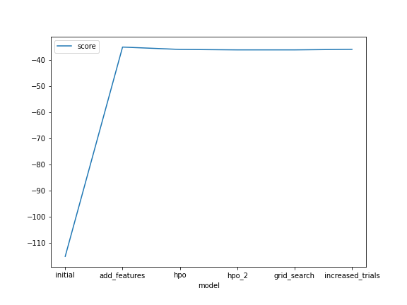
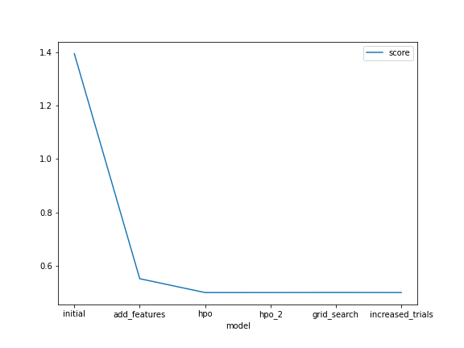

# Report: Predict Bike Sharing Demand with AutoGluon Solution
#### Snehal Bhagat

## Initial Training
### What did you realize when you tried to submit your predictions? What changes were needed to the output of the predictor to submit your results?
I realized that the predictions could not be directly used to add to the submission file.
Since the output of the predictor was a indexed, I had to specifically use only the values when updating the submission file with predictions.

### What was the top ranked model that performed?
The top ranked model with and without hyper parameter tuning was "WeightedEnsemble_L2"

## Exploratory data analysis and feature creation
### What did the exploratory analysis find and how did you add additional features?

The exploratory analysis helped understand the following about the dataset:

1) The windspeed column was slightly right skewed.
2) The attribute values were not in similar ranges with some attributes beind categorical and others numerical
3) The datetime column did not have the datatype correctly set to datetime
4) The categorical values had a datatype of int instead of category

### How much better did your model preform after adding additional features and why do you think that is?
The best performing model "WeightedEnsemble_L2" gave a 4 times better score of ~(-)36 from the original of ~(-)115.
I think this is because the additional features provided the ensemble techniques more categories to split the data on, where previously
it couldn't categorize based on each individual date in the datetime column.

## Hyper parameter tuning
### How much better did your model preform after trying different hyper parameters?
A) SCORE:
    In my case, the model performing slightly better in terms of the final Kaggle score.
    The Autogluon evaluation metric score however did not show any improvements.
B) PERFORMANCE:
    Increasing the number of trials from 1 to 5, significantly reduced the fit time for the best performing "WeightedEnsemble_L2" model
    reducing it from ~300 seconds to ~195 seconds
I think the overall change was because the increased number of trials provided additional permutations for the HPO during training.

It was also observed that, further increasing the number of trials from 5 to 10, did not result in any significant changes in the model performance.

### If you were given more time with this dataset, where do you think you would spend more time?

If given more time, I would tested the TabularPredictor with higher training time limits.
Since weighted ensemble was the best performing model, I would have tried customizing hyper parameters specific to this model.

### Create a table with the models you ran, the hyperparameters modified, and the kaggle score.

   model         |	num_bag_folds |	num_trials | num_bag_sets |	max_stack_levels |	score
-----------------|----------------|------------|--------------|------------------|---------
initial	         |      10        |   1        | 	0	      |      3	         | 1.39487
add_features     |      10	      |   1	       |    0	      |      3	         | 0.55149
hpo	             |      10	      |   5 	   |    0	      |      3	         | 0.49953
hpo_2	         |      5	      |   5	       |    2	      |      1	         | 0.49958
grid_search	     |      5	      |   5	       |    2	      |      1	         | 0.49982
increased_trials |	    5	      |   10	   |    2	      |      1	         | 0.49960

### Create a line plot showing the top model score for the three (or more) training runs during the project.

### Create a line plot showing the top kaggle score for the three (or more) prediction submissions during the project.

## Summary

The prediction was performed in 5 stages:

1) Initial raw data
2) After enriching the data by addition of new features and datatype specifications
3) Using custom hyperparameters for the hyperparameter_tune_kwargs argument in the fit method
4) Using custom hyperparameter values for num_bag_folds, num_bag_sets and num_stack_levels
5) Increasing the number of trials

